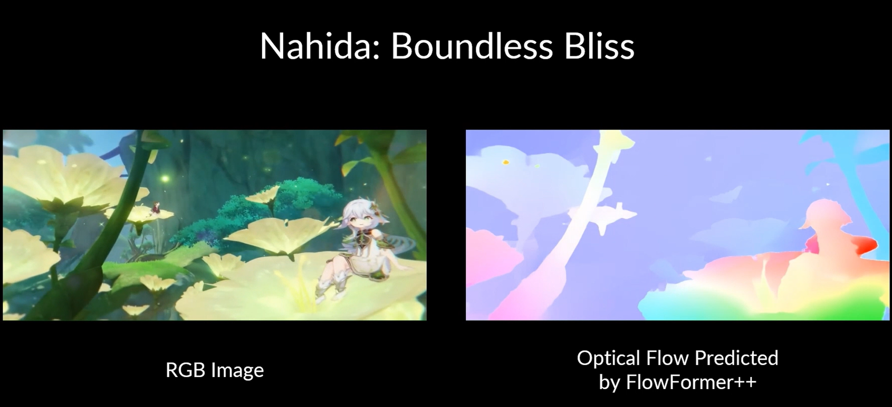

# FlowFormer++: Masked Cost Volume Autoencoding for Pretraining Optical Flow Estimation
<!-- ### [Project Page](https://drinkingcoder.github.io/publication/flowformer/)  -->

> FlowFormer++: Masked Cost Volume Autoencoding for Pretraining Optical Flow Estimation   
> Xiaoyu Shi<sup>\*</sup>, [Zhaoyang Huang](https://drinkingcoder.github.io)<sup>\*</sup>, [Dasong Li](https://dasongli1.github.io/), [Manyuan Zhang](https://manyuan97.github.io/), Ka Chun Cheung, Simon See, [Hongwei Qin](http://qinhongwei.com/academic/), [Jifeng Dai](https://jifengdai.org/), [Hongsheng Li](https://www.ee.cuhk.edu.hk/~hsli/)  
> CVPR 2023  



## Data Preparation
We first pretrain FlowFormer++ on the YoutubeVOS dataset. For finetuning, similar to RAFT, you will need to download the required datasets.
* [YoutubeVOS](https://youtube-vos.org/dataset/)
* [FlyingChairs](https://lmb.informatik.uni-freiburg.de/resources/datasets/FlyingChairs.en.html#flyingchairs)
* [FlyingThings3D](https://lmb.informatik.uni-freiburg.de/resources/datasets/SceneFlowDatasets.en.html)
* [Sintel](http://sintel.is.tue.mpg.de/)
* [KITTI](http://www.cvlibs.net/datasets/kitti/eval_scene_flow.php?benchmark=flow)
* [HD1K](http://hci-benchmark.iwr.uni-heidelberg.de/) (optional)

By default `datasets.py` will search for the datasets in these locations. You can create symbolic links to wherever the datasets were downloaded in the `datasets` folder

```Shell
├── datasets
    ├── Sintel
        ├── test
        ├── training
    ├── KITTI
        ├── testing
        ├── training
        ├── devkit
    ├── FlyingChairs_release
        ├── data
    ├── FlyingThings3D
        ├── frames_cleanpass
        ├── frames_finalpass
        ├── optical_flow
```

## Requirements
```shell
conda create --name flowformerpp
conda activate flowformerpp
conda install pytorch=1.6.0 torchvision=0.7.0 cudatoolkit=10.1 matplotlib tensorboard scipy opencv -c pytorch
pip install yacs loguru einops timm==0.4.12 imageio
```

## Training
The script will load the config according to the training stage. The trained model will be saved in a directory in `logs`. For example, the following script will load the config `configs/pretrain_config.py`. The trained model will be saved as `logs/xxxx/final`.
```shell
python -u pretrain_FlowFormer_maemask.py --stage youtube
```
To finish the entire finetuning schedule, you can run:
```shell
./run_train.sh
```

## Models
We provide [models](https://drive.google.com/drive/folders/1fyPZvcH4SuNCgnBvIJB2PktT5IN9PYPI?usp=sharing) trained in the four stages. The default path of the models for evaluation is:
```Shell
├── checkpoints
    ├── chairs.pth
    ├── things.pth
    ├── sintel.pth
    ├── kitti.pth
    ├── things_288960.pth
```

## Evaluation
The model to be evaluated is assigned by the `_CN.model` in the config file.

Evaluating the model on the Sintel training set and the KITTI training set. The corresponding config file is `configs/submissions.py`.
```Shell
# with tiling technique
python evaluate_FlowFormer_tile.py --eval sintel_validation
python evaluate_FlowFormer_tile.py --eval kitti_validation --model checkpoints/things_kitti.pth
```

Generating the submission for the Sintel and KITTI benchmarks. The corresponding config file is `configs/submissions.py`.
```Shell
python evaluate_FlowFormer_tile.py --eval sintel_submission
python evaluate_FlowFormer_tile.py --eval kitti_submission
```
Visualizing the sintel dataset:
```Shell
python visualize_flow.py --eval_type sintel --keep_size
```
Visualizing an image sequence extracted from a video:
```Shell
python visualize_flow.py --eval_type seq
```
The default image sequence format is:
```Shell
├── demo_data
    ├── mihoyo
        ├── 000001.png
        ├── 000002.png
        ├── 000003.png
            .
            .
            .
        ├── 001000.png
```


## License
FlowFormer++ is released under the Apache License

## Citation
```bibtex
@inproceedings{shi2023flowformer++,
  title={Flowformer++: Masked cost volume autoencoding for pretraining optical flow estimation},
  author={Shi, Xiaoyu and Huang, Zhaoyang and Li, Dasong and Zhang, Manyuan and Cheung, Ka Chun and See, Simon and Qin, Hongwei and Dai, Jifeng and Li, Hongsheng},
  booktitle={Proceedings of the IEEE/CVF Conference on Computer Vision and Pattern Recognition},
  pages={1599--1610},
  year={2023}
}
```

## Acknowledgement

In this project, we use parts of codes in:
- [RAFT](https://github.com/princeton-vl/RAFT)
- [GMA](https://github.com/zacjiang/GMA)
- [timm](https://github.com/rwightman/pytorch-image-models)
- [FlowFormer](https://github.com/drinkingcoder/FlowFormer-Official)